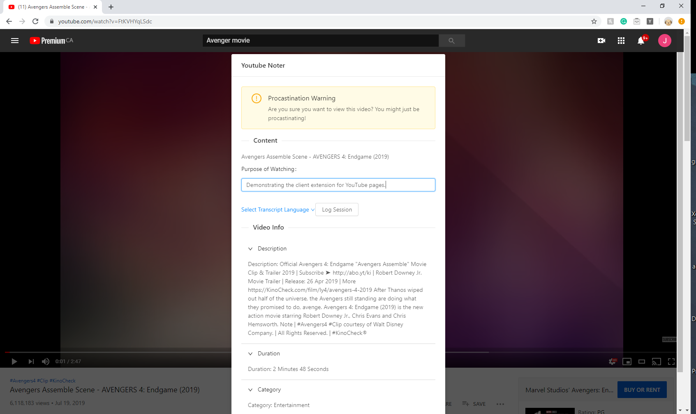
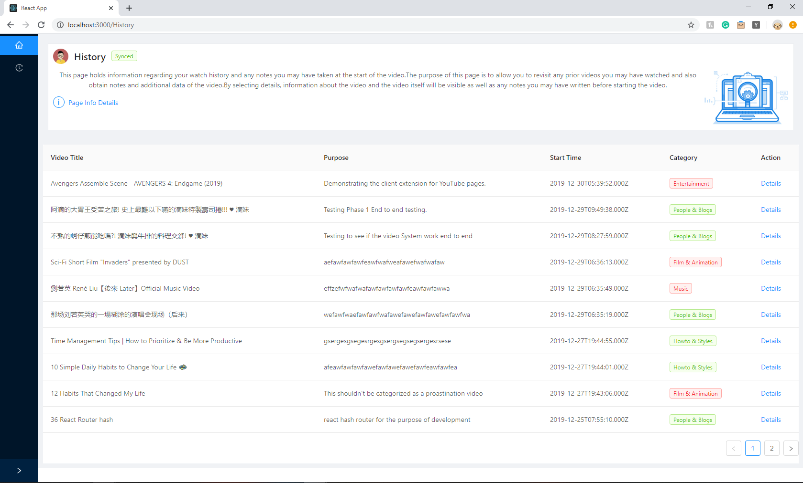
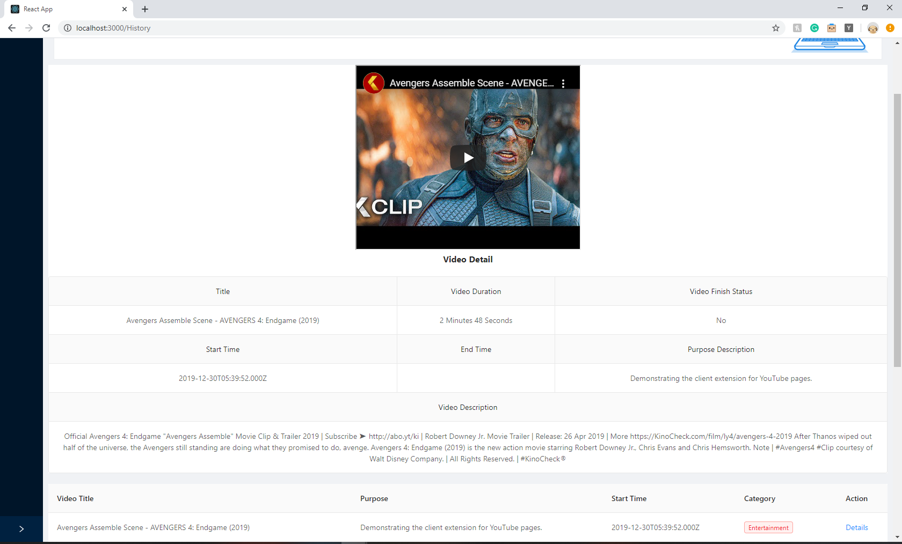
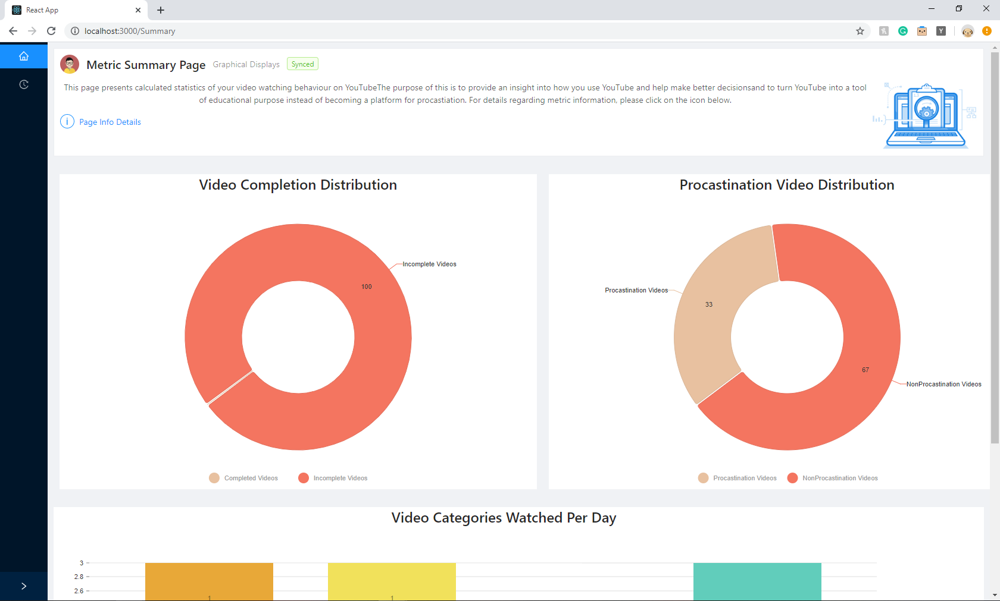
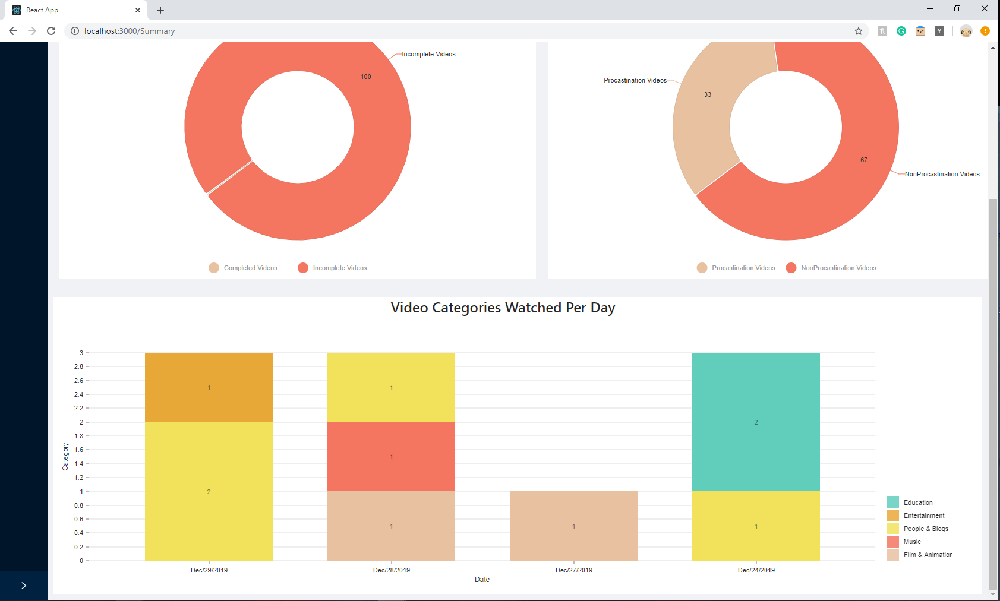
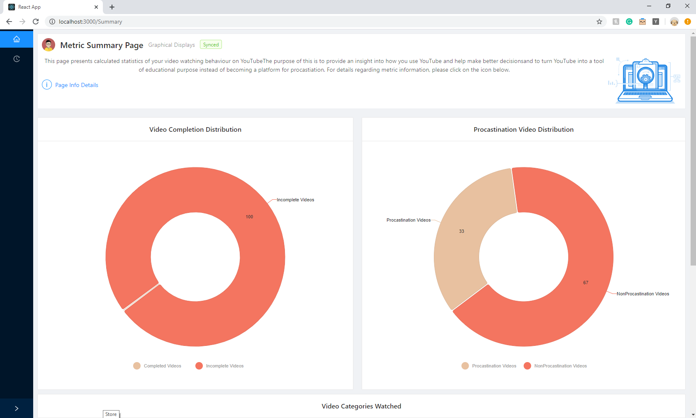
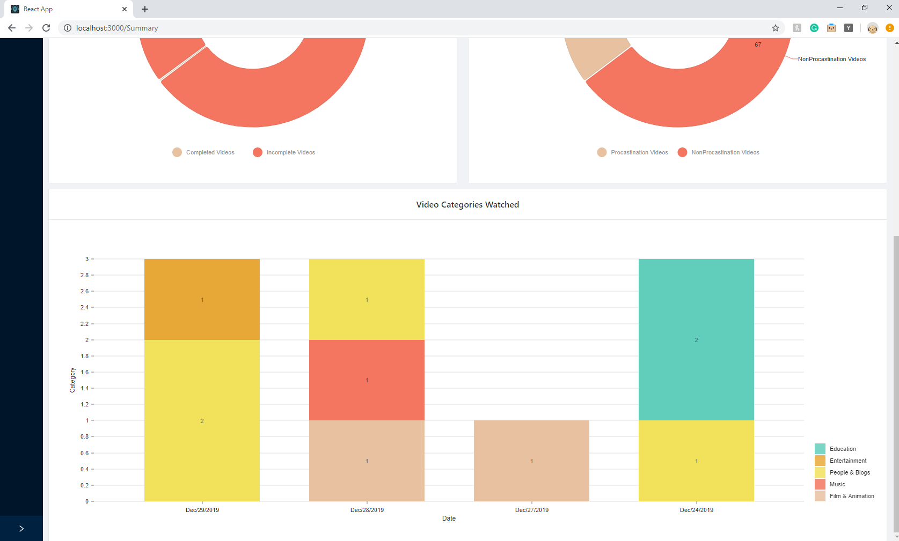

This Web-App is the client facing component of the project "Youtube Focus Reminder". 

Component-1 (Server): https://github.com/jameskanCa/Youtube-Server

Component-2 (Chrome Extension): https://github.com/jameskanCa/youtubeextension

Component-3 (Web App): You're viewing the web-app repo. 

Project Description: 
The purpose of this project is to turn YouTube into a useful tool instead of becoming mode of distraction. In addition, it is to provide insight into each individual's video watching habit.

Project Architecture:
Client extension and client web-app communicates with the server API endpoints to store and retreieve data. User information are stored according to their Google ID in the MongoDB database. Client extension operates only when user are viewing videos on YouTube, collecting video metadata as well as information user inputs when the modal pops up to indicate a video may be of distracting nature. 

Web-App communicates through REST calls to the server API to retrieve user data, including watch history and video metadatas. This data gets used to calculate metrics such as % of videos watched that are distracting and non-educational. A breakdown of user's video categories per day can be displayed. 

#Sample Images

